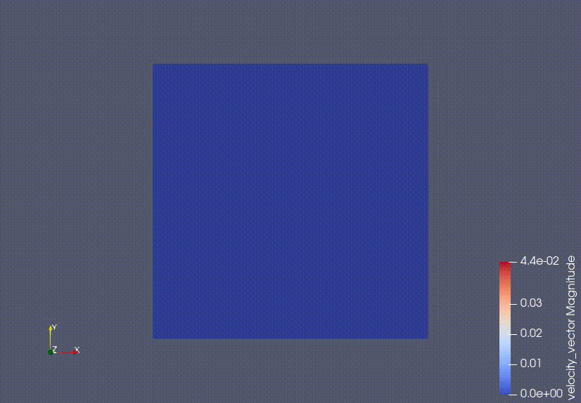

# D2Q9LBM-GPU
A simple CUDA-based LBM relization.

    

    Demo: 2D simulation of two jet flows

The belowing videos are demos from other codes. 

    

    Demo: 2D simulation of overset grid, resolution ratio = 1:1

    

    Demo: 2D simulation of overset grid, resolution ratio = 1:4

